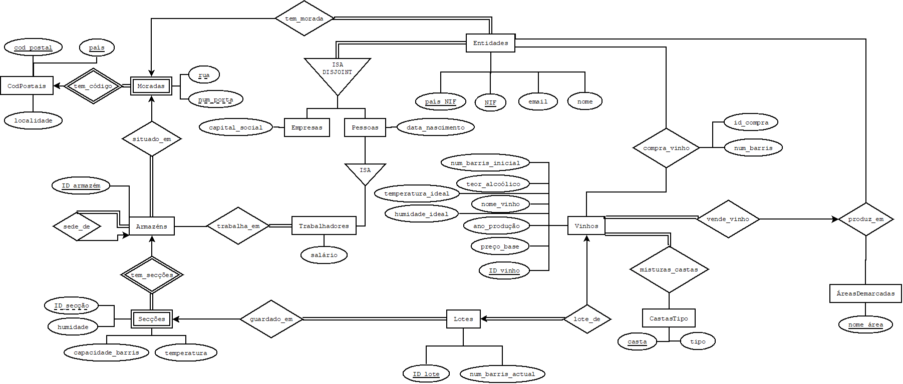

# Databases

### Course Focus:
This course has for an objective to teach the necessary skils for conception, construction, manipulation and analysis of *Relatinal Databases*. Topics:
* Data Models
* DB Normalization
* Relational Algebra
* SQL and other languages
* Integrity of reference
* Triggers and Assertions
* Segurança e autorizações
* Embedded SQL, ODBC, JDBC
* Security and grants
* Transactions
* Objects / relational DB
* XML

### Main DB Project
* Going throught all the steps in DB creation listed above, deploying a DB for a fictional wine cellar.
* Grade: --/20

Project Schema:
